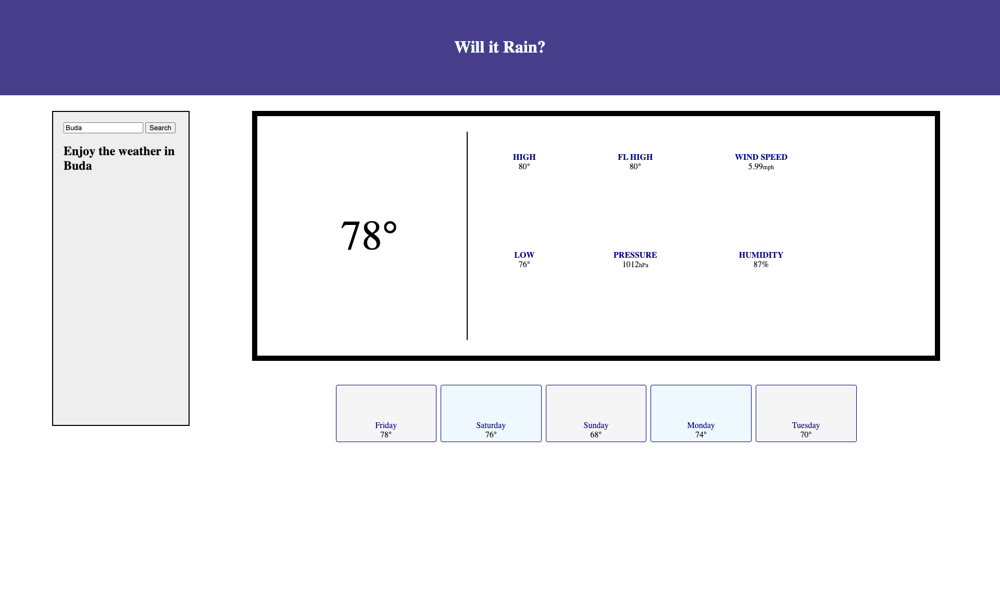

# will-it-rain

## Description

Knowing the weather makes all the difference when we are planning our day. Especially if we are planning a day in advance, or in a place we do not live locally. The ability to easily see what current conditions are for a specified locale, and what they will be like for the next week makes life easier.

The front dashboard opens with placeholder weather and a search field on the left. A user can enter the name of any city and submit that query by clicking the button or hitting the return key. Then in a moment, the current temperature of that city is displayed, along with current conditions which include the High and Low temp, the Feels like Temp, the Barometric pressure, Windspeed and Humidity. Below that, there is a forecast which shows the temperature for each day of the week for the following week. 

Where ever the user is spending the day, "Will it Rain" hopes they can enjoy the weather, being fully prepared for whatever weather comes their way! 

## Features

   - Input the name of a city and get the current and future weather for that city.

## Tools 

OpenWeather API:

https://openweathermap.org/api

## Credits

Web Dev Simplified on youtube
Stack Overflow

## License

Please refer to the LICENSE in the repo.

## Deployed Site:

https://yveivy.github.io/will-it-rain/
